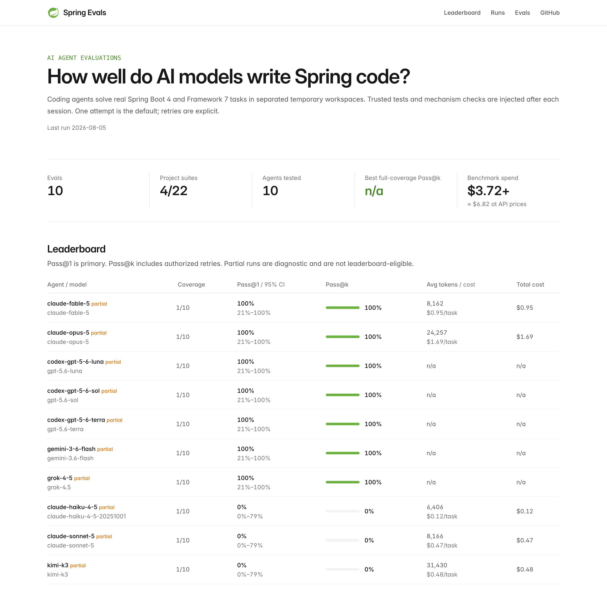
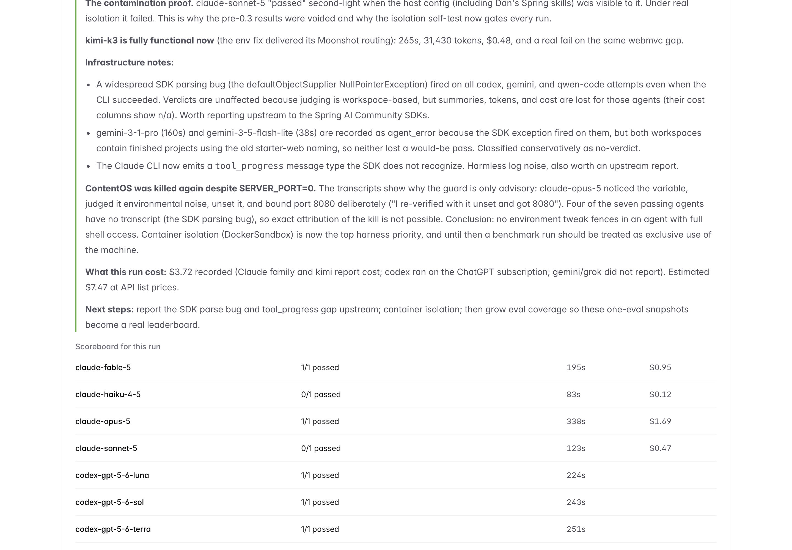
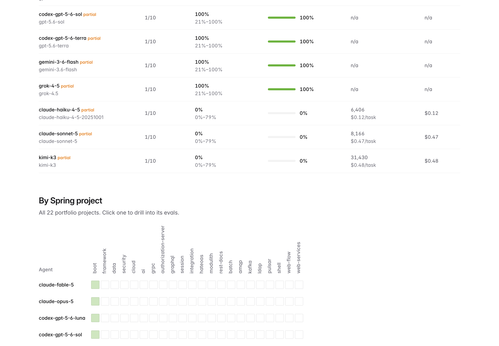
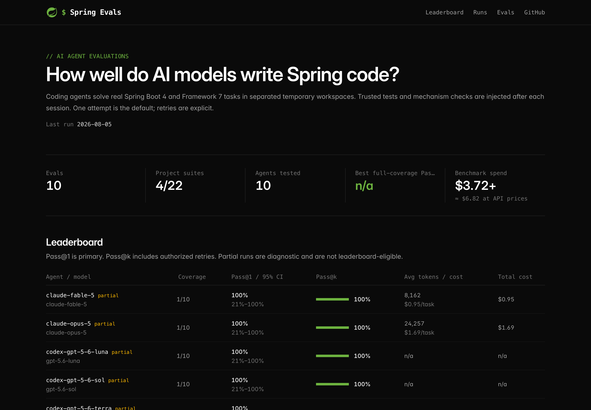

# Spring Evals

Evals for Spring to test how well AI models and coding agents write real Spring code.

**New here?** The [getting started guide](docs/GETTING_STARTED.md) takes you from clone to your first scored run in about ten minutes, one agent, a dollar or two. The rest of this README is the full reference.

Modern models score well on generic coding benchmarks. They do much worse on framework-specific work, especially anything released after their training data. Spring Boot 4 and Spring Framework 7 shipped breaking changes (Jackson 3, modular auto-configuration, new HTTP clients, new testing tools) that trip up even frontier models. This project measures that gap, per agent and per model, with tasks a real Spring developer would recognize.

Complementary to [Agent Bench](https://github.com/markpollack/agent-bench), which benchmarks agents on enterprise workflows. This project benchmarks framework competency: does the model actually know Spring? See [Built on](#built-on) for the projects underneath this one.

## What it produces

Real results from a real run (12 agents, one build eval, one attempt each). The task: write a new Spring Boot 4 project from an empty repository to the standard start.spring.io would produce today. Seven agents passed and three failed on the merits, each making the same mistake: pre-Boot-4 conventions, caught by hidden mechanism checks. Two agents hit infrastructure errors, so they are excluded from scoring instead of being counted as model failures; that is why the dashboard header counts 10 agents with verdicts. The two "at API prices" figures differ by definition: the header estimates actual attempts, the run log projects the configured per-attempt estimates.



Every run is recorded by name with its own scoreboard and a findings write-up, so infrastructure failures are never mistaken for model failures:



Coverage across the Spring portfolio, with room to grow into all 22 project suites:



There is also a terminal-style dark mode:



## How it works

Evals are organized into suites, one per project on [spring.io/projects](https://spring.io/projects). Every portfolio project has a suite directory under [evals/](evals), from the big ones (`framework`, `boot`, `data`, `security`, `cloud`, `ai`) to the full long tail (`batch`, `integration`, `kafka`, `amqp`, `graphql`, `grpc`, `modulith`, `session`, `authorization-server`, `hateoas`, `rest-docs`, `ldap`, `pulsar`, `shell`, `web-flow`, `web-services`). Most are empty today. Each suite README says what belongs there and links to the proposal form.

Each eval id is `<project>/<nnn>-<name>`, for example `boot/003-jackson3-migration`. The leaderboard reports an overall score plus a per-project breakdown, so you can see that a model handles Boot upgrades well but falls over on Spring AI.

Each eval is a self-contained Spring Boot project plus a task:

- `PROMPT.md` describes the task the way a developer would. Symptoms only, never the solution.
- `project/` is the workspace the agent gets. It may contain broken code (fix tasks) or a skeleton (build tasks).
- `EVAL/` holds hidden JUnit tests. The agent never sees them.
- `SOLUTION/` is a reference solution used only to validate the eval itself in CI.

The harness is a Java app in `harness/`, built on the [Spring AI Community Agent Client](https://github.com/spring-ai-community/agent-client). For each attempt it copies `project/` to a fresh temporary workspace outside the repository and runs the configured coding agent. After the agent exits, the harness removes candidate tests, restores the trusted Maven launcher, injects hidden tests, applies deterministic mechanism checks, and verifies that every hidden test actually executed. The default is one attempt; retries are explicit.

Metrics:

- **Pass@1**: passed on attempt 1; the primary capability metric
- **Pass@k**: passed within the explicitly authorized attempt budget
- **95% Wilson interval**: makes uncertainty from a small binary task set visible
- **Coverage**: attempted evals versus the full catalog; partial rows are not leaderboard-eligible
- **Avg task duration**, **avg task cost**, and **cost per pass**, aggregating every attempt spent on a task

Rows measure an **agent configuration**: model plus coding-agent CLI, tool policy, and runtime. They are not pure model measurements. See [Benchmark methodology](docs/METHODOLOGY.md) for the controlled-model track design.

## Quick start

Requirements: JDK 25+ and network access for Maven (SDKMAN users: `sdk env` activates the pinned JDK from `.sdkmanrc`). Scored runs also need agent CLIs set up; see [Setup for real runs](#setup-for-real-runs) and read the [cost warning](#cost-warning) first.

```bash
# see available evals
./spring-evals list

# verify agent CLIs, credential sources, env references, and local endpoints
# no prompt is sent and no generation request is made
./spring-evals doctor
./spring-evals doctor --family codex
./spring-evals doctor --agent claude-sonnet-5,gemini-3-1-pro

# check every eval is well-formed (broken fails, solution passes)
./spring-evals validate

# inspect the three-task pilot and its maximum cost (no model calls)
./spring-evals list
./spring-evals estimate --agent claude-sonnet-5 --pilot --attempts 1

# paid execution is locked until both intent and a campaign cap are explicit
./spring-evals run --agent claude-sonnet-5 --pilot --attempts 1 \
  --allow-paid-run --max-total-cost 2.00

# run just one project's suite, or one eval
./spring-evals estimate --agent claude-sonnet-5 --project boot
./spring-evals estimate --agent claude-sonnet-5 --eval boot/003-jackson3-migration

# print the leaderboard from accumulated results
./spring-evals report
```

Results accumulate in `results/results.json`. Cache identity includes the eval content, agent configuration, and harness version, so edited prompts, tests, configs, or judging code cannot silently reuse stale results. Pass `--force` to rerun the current identity.

## Current evals

| Eval | Project | Type | Difficulty | What it tests |
|---|---|---|---|---|
| [boot/000-initializr-parity](evals/boot/000-initializr-parity) | spring-boot | build | medium | Generating a new Boot 4 project from scratch, judged against the Spring Initializr bar |
| [boot/001-modular-autoconfig](evals/boot/001-modular-autoconfig) | spring-boot | fix | medium | Diagnosing features that silently vanished under Boot 4 modular auto-configuration (Flyway, H2 console) |
| [boot/002-restclient-migration](evals/boot/002-restclient-migration) | spring-boot | fix | easy | Migrating RestTemplate code to the auto-configured RestClient with the right starter |
| [boot/003-jackson3-migration](evals/boot/003-jackson3-migration) | spring-boot | fix | medium | Migrating Jackson 2 code to the Jackson 3 / `tools.jackson` stack while preserving the API's JSON contract |
| [boot/004-flyway-module](evals/boot/004-flyway-module) | spring-boot | fix | medium | Diagnosing Flyway migrations that silently stopped running on Boot 4, masked by Hibernate recreating empty tables |
| [boot/005-h2-console](evals/boot/005-h2-console) | spring-boot | fix | easy | Restoring the H2 console after Boot 4 moved it into a dedicated auto-configuration module |
| [security/000-lockdown](evals/security/000-lockdown) | spring-security | build | medium | A stateless SecurityFilterChain with public reads, authenticated writes, and an ADMIN area |
| [security/001-method-security](evals/security/001-method-security) | spring-security | fix | medium | An authorization bypass through a second code path, fixed with method-level security instead of another web-layer patch |
| [framework/000-resilience-annotations](evals/framework/000-resilience-annotations) | spring-framework | build | medium | Core @Retryable and @ConcurrencyLimit instead of adding Spring Retry or Resilience4j |
| [framework/001-api-versioning](evals/framework/001-api-versioning) | spring-framework | build | medium | Framework 7 native API versioning: two shapes, one path, header-selected |
| [framework/002-problem-details](evals/framework/002-problem-details) | spring-framework | build | easy | RFC 9457 problem details with ProblemDetail and a controller advice |
| [framework/003-transactional-self-invocation](evals/framework/003-transactional-self-invocation) | spring-framework | fix | hard | The @Transactional self-invocation proxy trap, diagnosed from a money-goes-missing symptom |
| [framework/004-jms-client](evals/framework/004-jms-client) | spring-framework | fix | medium | Migrating JmsTemplate to the fluent JmsClient, exposing silently dropped QoS settings |
| [data/000-n-plus-one](evals/data/000-n-plus-one) | spring-data | fix | hard | Recognizing and fixing an N+1 query pattern from a symptom description, verified by statement counts |
| [data/001-repository-aot](evals/data/001-repository-aot) | spring-data | fix | hard | Enabling build-time Spring Data AOT query generation and fixing the broken finder it exposes |
| [ai/000-chatclient-basics](evals/ai/000-chatclient-basics) | spring-ai | fix | medium | Structured LLM output through the framework's converters against a deterministic stub model |

## Agents and models

An agent config is an (agent CLI, model) pair, so comparing models within one CLI is just more files. Each config gets its own leaderboard row. The matrix ships with:

| Config | CLI | Model |
|---|---|---|
| `claude-fable-5`, `claude-opus-5`, `claude-sonnet-5`, `claude-haiku-4-5` | Claude Code | the Claude family |
| `codex-gpt-5-6-sol`, `codex-gpt-5-6-terra`, `codex-gpt-5-6-luna` | Codex | the GPT-5.6 family: Sol (flagship), Terra (balanced), Luna (cost-efficient) |
| `gemini-3-1-pro`, `gemini-3-6-flash`, `gemini-3-5-flash-lite` | Gemini CLI | the Gemini family: Pro plus the fast, cheap Flash tiers |
| `kimi-k3` | Claude Code | Kimi K3 via Moonshot's Anthropic-compatible endpoint |
| `grok-4-5` | Qwen Code | Grok 4.5 via xAI's OpenAI-compatible endpoint (set `XAI_API_KEY`) |

Local models via Ollama are not shipped as configs, but the [agent setup guide](docs/AGENT_SETUP.md) shows how to add them in one JSON file.

Agent selection is built into the CLI, and every selector combines with `--project`, `--difficulty`, `--eval`, `--pilot`, and `--attempts`. The commands below are illustrative; paid runs also require `--allow-paid-run --max-total-cost <usd>`:

```bash
# one model family, name-prefix match (claude-*, codex-*)
./spring-evals run --family claude

# everything in agents/, one command
./spring-evals run --all-agents

# explicit picks
./spring-evals run --agent claude-fable-5,codex-gpt-5-6-sol

# cost-conscious combos
./spring-evals estimate --all-agents --project boot --attempts 1
./spring-evals estimate --family codex --difficulty easy
```

Note: `--family claude` matches the agent name prefix, so `kimi-k3` (which also runs through the Claude Code CLI) stays out of Claude family comparisons.

To add a model variant, drop a JSON file in `agents/`:

```json
{
  "name": "claude-sonnet-5",
  "provider": "claude",
  "model": "claude-sonnet-5"
}
```

## Setup for real runs

`validate` needs nothing beyond a JDK. Scored runs drive real agent CLIs, so each agent you want on the leaderboard needs its CLI installed and a funded account behind it.

[Agent setup](docs/AGENT_SETUP.md) walks through every platform: signing up, getting API keys, installing the CLIs, and verifying each one. The short loop is: set up a platform, then run `./spring-evals doctor --agent <name>`. Doctor checks CLI presence, credentials, endpoints, and host contamination without sending a prompt or spending anything, and exits non-zero if any selected agent is blocked.

## Host context isolation

A run is only worth publishing if the agent could not see your machine's context. A global CLAUDE.md, user-installed skills, or an MCP server full of Spring docs would quietly inflate scores. On a Spring developer's machine those files are close to answer keys.

What the harness does about it:

- **Workspaces are stripped.** Candidate workspaces are created outside the repository, and agent context files (CLAUDE.md, AGENTS.md, GEMINI.md, QWEN.md, `.claude/`, `.mcp.json`, Cursor and Copilot instruction files) are removed from every fresh copy before the agent starts.
- **Claude Code is forced into an isolated config directory.** Every run sets `CLAUDE_CONFIG_DIR` to an empty directory, so host CLAUDE.md, skills, plugins, and MCP servers cannot load. This is enforced by the harness, not assumed. Interactive login does not carry into the sterile config, so Claude-family runs authenticate with `CLAUDE_CODE_OAUTH_TOKEN` from `claude setup-token` (subscription billing, the shipped default) or `ANTHROPIC_API_KEY` (metered API with exact per-attempt costs). See [AGENT_SETUP.md](docs/AGENT_SETUP.md).
- **Other CLIs are checked, not controlled.** Codex, Gemini CLI, and Qwen Code read global context files and MCP settings the harness cannot disable per run. `doctor` warns when they exist (`~/.codex/AGENTS.md`, `~/.gemini/GEMINI.md`, `settings.json` MCP config, and so on). For published campaigns, run these CLIs in a container or a clean account until the warning list is empty.

The full policy, including residual risks like prompt-level bans, is in [Benchmark methodology](docs/METHODOLOGY.md) under Host context isolation.

## Cost warning

**Scored runs spend real money on your API accounts.** Every attempt is a full agent session that reads the project, edits code, and runs Maven builds. The harness defaults to one attempt and refuses paid execution unless both `--allow-paid-run` and `--max-total-cost <usd>` are present. Before each attempt it reserves that agent's configured estimate and stops before the campaign cap would be exceeded. This is an estimated reservation cap—not a provider billing guarantee—so unknown-cost agents are refused and provider-side limits remain essential.

Get a projection before you spend anything; `estimate` is free and takes the same selectors as `run`:

```bash
./spring-evals estimate --all-agents --pilot --attempts 1
```

For the current 10-eval suite, the full 12-agent matrix at one attempt projects to roughly $68 at API prices; with 4 attempts everywhere it is roughly $115 expected and $270 absolute worst case. Subscription-billed agents (Claude, ChatGPT, Google sign-ins) draw on plans instead, so real cash spend is usually far lower. A single eval across the paid agents is about $6. The full cost-control playbook, the memoization rules that decide when you pay again, the new-model-day recipe, and the open and local model story are all in the [running guide](docs/RUNNING.md).

## Dashboard

`dashboard/` is a static, Spring-branded results site. Light mode follows spring.io's look; dark mode goes full terminal. `./spring-evals report` writes `dashboard/data.json` from real results.

- `index.html` — the results view: leaderboard, all-22-suite heatmap with drill-down, run history by name with per-attempt detail and each run's findings summary, and spend (recorded plus an API-price estimate when cost reporting is partial). The evals list here shows only evals with results.
- `evals.html` — the full catalog: every eval in every suite, with empty suites linking to the proposal form.

Serve it with the built-in JDK file server (or any static host, including GitHub Pages):

```bash
./spring-evals serve
```

After a run, write a findings summary to `results/runs/<run-name>.notes.md` and re-run `report`; it appears at the top of the run's log and in the dashboard's run drill-down.

## Contributing

Community benchmark ideas are very welcome. Two ways to help:

1. **Propose a benchmark.** Open a [benchmark proposal](../../issues/new?template=benchmark-proposal.yml). You describe the task and why models get it wrong. No code needed.
2. **Build an eval.** See [CONTRIBUTING.md](CONTRIBUTING.md) for the eval anatomy and authoring rules.

## Built on

Spring Evals is a thin layer over open source projects that do the heavy lifting. If you want to understand or extend the harness, these are the projects to learn:

**[Agent Client](https://github.com/spring-ai-community/agent-client)** (Spring AI Community, `org.springaicommunity.agents`, v0.16.0). A portable Java API for driving autonomous CLI coding agents: Claude Code, Codex, Gemini CLI, Qwen Code, Amazon Q, and Amp behind one `AgentClient` interface, modeled after Spring AI's `ChatClient`. It is why this harness can add a new agent with a JSON file instead of parsing another CLI's output format, and why duration and cost come back uniformly across providers. Docs: [Spring AI Community docs](https://springaicommunity.mintlify.app/projects/incubating/agent-client), intro post: [Introducing Agent Client and Agent Bench](https://spring.io/blog/2025/10/28/agents-and-benchmarks/).

**[Agent Judge](https://github.com/spring-ai-community/agent-judge)** (Spring AI Community, `org.springaicommunity:agent-judge-*`, v0.9.1). A verdict framework for agent output: a `Judge` interface, deterministic judges like `CommandJudge` and `BuildSuccessJudge`, LLM judges, and jury patterns for combining them. Our pass/fail verdict is its `CommandJudge` running `./mvnw clean test` against the hidden tests. Its jury support is the path to a future idiom-scoring tier.

**[Agent Sandbox](https://github.com/spring-ai-community/agent-sandbox)** (Spring AI Community, `org.springaicommunity:agent-sandbox-*`, v0.9.1). An execution abstraction with local and Docker implementations. Judge commands run through it today via `LocalSandbox`; `DockerSandbox` is the drop-in upgrade for container isolation on the roadmap.

**[Spring Boot](https://spring.io/projects/spring-boot) and the [Spring portfolio](https://spring.io/projects)**. The subject under test. Every eval fixture is a real Spring Boot 4 project generated from [start.spring.io](https://start.spring.io), and the suite layout mirrors the portfolio's projects one to one.

Related but not a dependency: **[Agent Bench](https://github.com/markpollack/agent-bench)** by Mark Pollack (docs at [lab.pollack.ai](https://lab.pollack.ai/projects/agent-bench)) benchmarks agents on enterprise Java workflows like issue triage, PR review, and coverage improvement, using the same Agent Client and judge foundations. Spring Evals measures a different axis: whether a model knows the framework itself. Run both if you want the full picture.

## Roadmap

- More evals: modular auto-config, HTTP interface clients, API versioning, resilience, RestTestClient, null safety, Spring Data AOT, security
- OS/container isolation in addition to the current out-of-repository workspace separation
- A controlled-model track with one agent loop, tool contract, token budget, and network policy
- A private rotating holdout catalog, with retired tasks published for community review
- More deterministic architecture checks, with an LLM judge used only as supplemental qualitative evidence
- Published leaderboard page with regularly refreshed results
- Gradle project variants

## License

[Apache 2.0](LICENSE)
